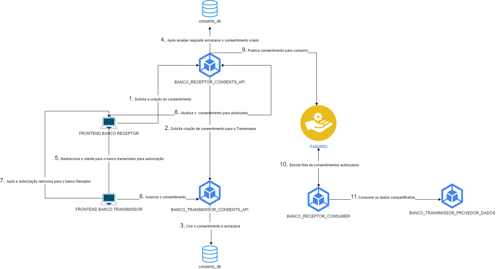

## Trabalho de CLOUD DEVELOPMENT

- Turma: 1SCJRBB
- Disciplica: CLOUD DEVELOPMENT
- Professor: LUCAS SIMÕES MAISTRO

### Desenho da solução

### Apresentação da solução. 
TODO: INCLUIR LINK.

### Tecnologias utilizadas
- Service App Azure
- MySQL Cloud Azure
- RabbitMQ Cloud Azure
- NodeJs
- Typescript
- Nestjs - Framework para backend Nodejs
- Angular
- Nx - Monorepo
- MySQL
- RabbitMQ
- Docker

### Links da solução rodando na Azure

TODO: Incluir os links.

### Desenvolvedores

| RM  | Aluno | Turma |
| ------------- |:-------------:| --------- | 
| 344792      | Benisson dos Santos Lopes     | 1SCJRBB-2022 |
| 344799      | Leonardo Guerra Torres Filho     | 1SCJRBB-2022 |
| 344801      | Lucas Eugenio Ribeiro     | 1SCJRBB-2022 |
| 344794      | César de Lira Santos     | 1SCJRBB-2022 |
| 344791      | Anderson Evangelista     | 1SCJRBB-2022 |
